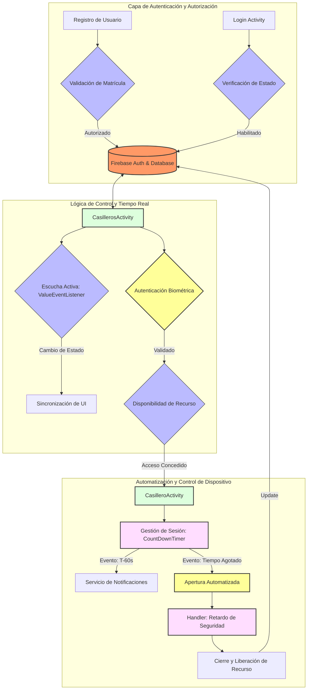

```mermaid
graph TD
    classDef database fill:#f96,stroke:#333,stroke-width:2px;
    classDef sensor fill:#ff9,stroke:#333,stroke-width:2px;
    classDef logic fill:#bbf,stroke:#333,stroke-width:1px;
    classDef timer fill:#fdf,stroke:#333,stroke-width:2px;
    classDef activity fill:#dfd,stroke:#333,stroke-width:2px;

    subgraph Modulo_Seguridad [Capa de Autenticación y Autorización]
        A1[Registro de Usuario] --> A2{Validación de Matrícula}
        A2 -->|Autorizado| A3[(Firebase Auth & Database)]
        L1[Login Activity] --> L2{Verificación de Estado}
        L2 -->|Habilitado| A3
    end

    subgraph Capa_Negocio [Lógica de Control y Tiempo Real]
        A3 <--> B1[CasillerosActivity]
        B1 --> B2{Escucha Activa: ValueEventListener}
        B2 -->|Cambio de Estado| B3[Sincronización de UI]
        
        B1 --> B4{Autenticación Biométrica}
        B4 -->|Validado| B5{Disponibilidad de Recurso}
    end

    subgraph Capa_Hardware [Automatización y Control de Dispositivo]
        B5 -->|Acceso Concedido| C1[CasilleroActivity]
        C1 --> C2[Gestión de Sesión: CountDownTimer]
        C2 -->|Evento: T-60s| C3[Servicio de Notificaciones]
        
        C2 -->|Evento: Tiempo Agotado| C4[Apertura Automatizada]
        C4 --> C5[Handler: Retardo de Seguridad]
        C5 --> C6[Cierre y Liberación de Recurso]
        C6 -->|Update| A3
    end

    class A3 database;
    class B4,C4 sensor;
    class A2,L2,B2,B5 logic;
    class C2,C5 timer;
    class B1,C1 activity;
```
